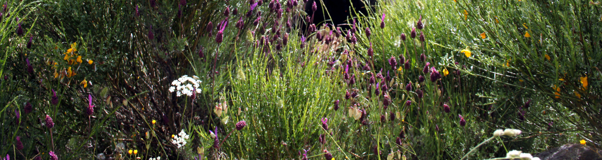

```{r setup, include=FALSE}
knitr::opts_chunk$set(echo = TRUE)
```



# Functional biogeography of the thermal thresholds for post-dispersal embryo growth in *Conopodium majus*

This repository stores all the information related to the manuscript [*Functional biogeography of the thermal thresholds for post-dispersal embryo growth in Conopodium majus*](https://doi.org/10.1093/aob/mcae204), including the raw datasets.

## Contents

This repository is organised following the advice of [Wilson et al. 2017](https://doi.org/10.1371/journal.pcbi.1005510) for recording and storing research projects.


The following materials are available in the folders of this repository:

* `data` Data files including the lab and field experiments. See `data/README` for a description of each file.
* `doc` Accepted manuscript.
* `results` Figures and model results.
* `src` Scripts in `R` language for data analysis.

## Abstract

* **Background and Aims** Plant regeneration by seeds is driven by a set of physiological traits, many of which show functional intraspecific variation along biogeographic gradients. In many species, germination phenology depends on a germination delay imposed by the need for post-dispersal embryo growth (a.k.a. morphological dormancy). Such growth occurs as a function of environmental temperatures and shows base, optimum and ceiling temperatures (i.e. cardinal temperatures or thermal thresholds). However, the biogeographical variation in such thresholds has not been tested. 
* **Methods** We used a thermal time approach and field experiments to assess intraspecific variation at the continental scale in the embryo growth thermal thresholds of the geophyte *Conopodium majus* (Apiaceae) across its distribution from the Iberian Peninsula to Scandinavia. 
* **Key Results** Thermal thresholds for embryo growth varied across the latitudinal gradient, with the estimated optimum temperatures between 2.5 and 5.2 ºC, ceiling temperatures between 12 and 20.5 ºC and base temperatures between -6.6 and -2.7 ºC. Germination in the field peaked in the months of January and February. The limiting factor for embryo growth was the ceiling temperature, which was negatively correlated with latitude and the bioclimatic environment of each population. In contrast, the optimal and base temperature were independent of local climate. 
* **Conclusions** These results indicate that thermal thresholds for embryo growth are functional ecophysiological traits that drive seed germination phenology and seed responses to soil climatic environment. Therefore, post-dispersal embryo growth can be a key trait impacting climate change effects on phenology and species distributions.

## Citation

Please cite the repository, datasets and article as: 

> Blandino C, Natlandsmyr B, Sandvik SM, Pritchard HW, Fernández-Pascual E [Functional biogeography of the thermal thresholds for post-dispersal embryo growth in *Conopodium majus*.](https://doi.org/10.1093/aob/mcae204) *Annals of Botany*, mcae204.